# Робота з індексами в Amazon Document DB

Так звана premature optimization - не завжди необхідна та забирає багато часу, не завжди така ефективна та після
додаткових вимог може і зовсім потягнути на дно.
Але оптимізувати код звичайно треба, коли є така потреба. Наприклад запит в базу, який виконує отримання перших 16
результатів сторінки аж 40 секунд…

Запит сам по собі не виглядає страшним. Той самий Entity Framework під час оптимізації видає ще те ще дерево запитів яке
довго намагатися зрозуміти.

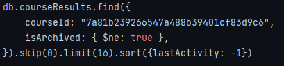

---

Коли маєш діло з такого роду проблемою, зразу виниш індекс

- Для налагоджування запитів використовуємо команду `explain('executionStats')`
  - Параметр `executionStats` окрім роз'яснення етапів обраного плану також додає час виконання для кожного
  - В монзі також наявний варіант запиту, що показує усі можливі плани виконання

  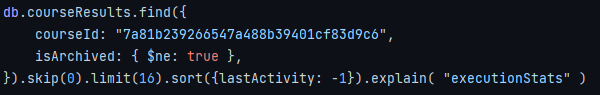

  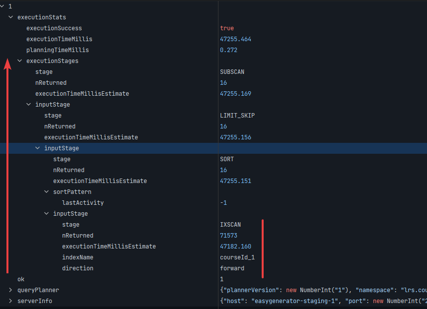

  - Дерево етапів запиту потрібно дивитися знизу вверх
  - На першому етапі йде вибірка за індексом
- Для даного запиту, планер обрав індекс під назвою `courseId_1` . Що є індексом одного поля та не покриває сортування
  за `lastActivity`. Перевіряємо наявні індекси та бачимо що є більш оптимальний варіант складного
  індексу `courseId_1_lastActivity_1_isArchived_1`

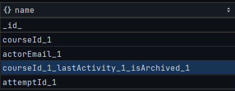

- Для того, щоб розібратися більше, потрібно поговорити про самі індекси

### Індекс обирається як мінімум за наступними критеріями:

- Індекс вказаний за допомогою команди `hint`
- Індекс не схований. Для того, щоб протестувати швидкодію запитів без індексу не потрібно його видаляти, можна сховати
  від планувальника запитів `hideIndex` `unhideIndex`
- Він в пам’яті
- Відповідність правилу **ESR (Equality, Sort, Range).** Правило порядку полів в складному індексі. Порядок показує
  пріоритет сортування в структурі складного індексу і повинен відповідати
  правилу **[ESR (Equality, Sort, Range)](https://www.mongodb.com/docs/manual/tutorial/equality-sort-range-rule/),** за
  якого спочатку йдуть поля які в запитах фільтруються за допомогою операторів повного збігу, наприклад `$eq`,
  далі йдуть поля за якими відбувається сортування (при чому сортування повинно відповідати сортуванню індексу в прямому
  або оберненому порядку), останніми йдуть оператори діапазону `$gt`, `$gte`, `$lt`, `$lte`, `$ne`.

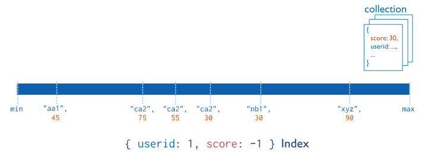

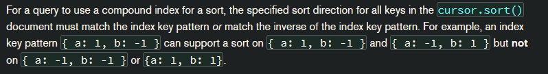

- Але ми забули з яким типом звірюки ми маємо діло (Amazon)

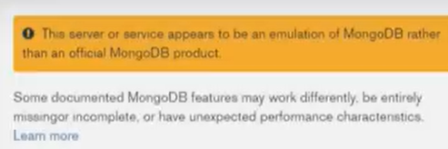

### Специфіки Doc DB

- Відсутність можливості сховати індекс від планера запиту
- Підтримка роботи операторів з індексами

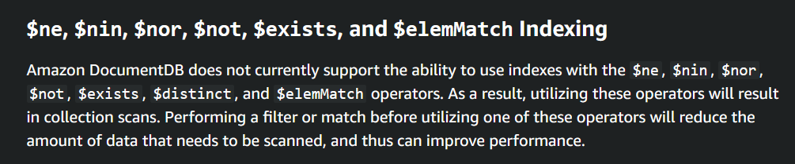

---

- Крім того, що наш запит має оператор діапазону `$ne`, як виявилося пізніше назва індексу не відповідає порядку
  полів, тобто порушена відповідність правилу **ESR (Equality, Sort, Range).**

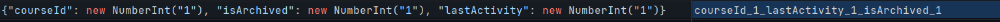

- Тобто, фактично, якби порядок полів відповідав назві індекс, то запит підпадав під правило prefix. Складні індекси
  можуть перевикористовуватися в запитах, які використовують частину цього індекс (index prefix)

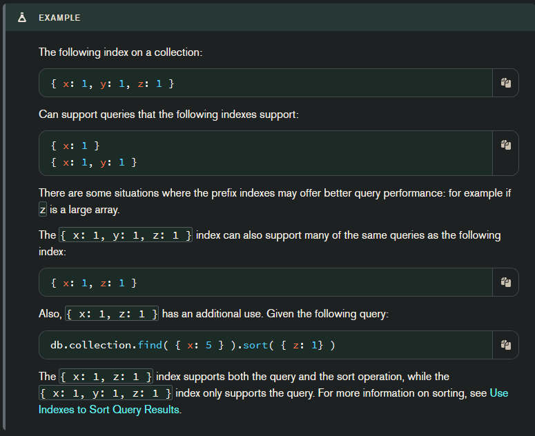

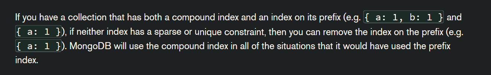

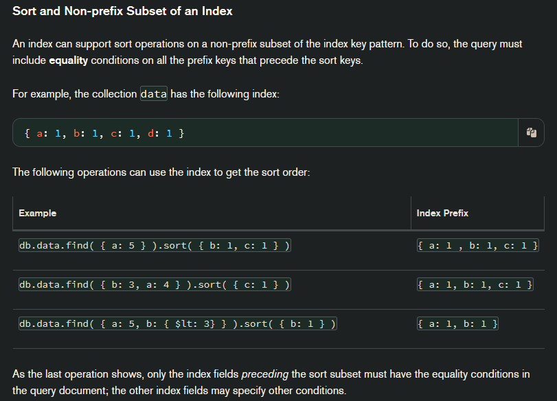

- Після виправлення умови запиту таким чином, щоб використовувати оператор рівності для поля `isArchived`, та
  встановлення значення для поля `isArhived` документів, в який це поле відсутнє, індекс почав відповідати правилу ESR, тому саме він був обраний для запиту, як видно з іншого запиту `explain()`

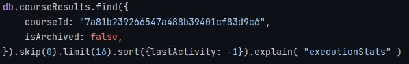

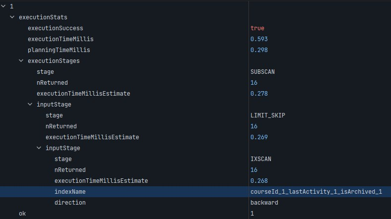

### Індекси

- Простий індекс `single field`
- Складний індекс `compound`
- Hashed - послідовне хешування, яке може бути використано для шардінга. Знаючи значення поля, наприклад айдішнік юзера,
  ми можемо порахувати хеш та подивитися, що значення хеша попадає в межі третього сервера бази даних, який і зберігає
  документ користувача
- Індекси гео запитів `2dsphere`, `2d`
- Text, wildcard, regex - спрощена версія Elasticsearch, яка дозволяє обробити текст необхідної мови, прибравши стоп
  слова (the, a, an), обрізавши слово до кореня (stemming), вказати роздільник. Але, Elastic все ж гнучкіший, адже
  дозволяє налаштовувати флоу обробки тексту під себе, та має інші методи обробки тексту, наприклад додавання
  синонімів (2 - “two”)

### Модифікації індексів

- TTL - видаляє запис після спливання часу. Точність не гарантована. Потрібно оптимізувати кількість записів що потрібна
  бути видалена. Тобто якщо у нас лог, в який кожну секунду потрапляють записи, які нам потрібно видалити через 7 днів
  після створення, потрібно робити групування, наприклад в бакети погодинно або подобово та створювати індекс для них. В
  іншому випадку під час видалення буде досить сильне навантаження. Amazon також рекомендує групувати записи в колекції
  та видаляти їх повністю, бо це не навантажує систему (IO cost), що збільшує ціну, на відміну від того, коли нам
  кожну хвилину потрібно видаляти купу логів. Монга також каже використовувати Time series колекцій, що по суті також
  групують записи в бакети по часу, або вони пропонують
- Partial, Sparse (конкретна версія partial індексу) - якщо для більшості запитів не потрібно повертати якусь частину
  колекції (заархівовані записи), ми можемо використати partial індекс та вказати умову, за якої документ буде
  індексуватися. Таким чином можна створити два індексу для різних типів запитів. Sparse - індексує тільки ті документи,
  які мають індексоване поле, цього можна досягти вказавши відповідну умову при створенні часткового індексу. (Не працює
  в Doc db)
- Індексування масивів - індексується кожен елемент/документ масиву

### Специфіки Doc DB

- Підтримка індексів

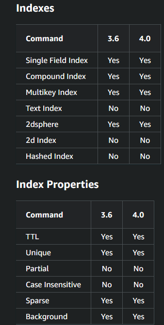

### Чекліст по створенню індексу:

- Створювати індекси, що мають високу вибірковість. Тобто не на полях з декількома можливими значеннями, як, наприклад
  boolean, або на тих полях, для яких використовуються оператори діапазону `$gt`, `$gte`, `$lt`, `$lte`
- Перевірити відповідність складних індексів правилу ESR.
- Якщо запит отримує тільки поля документа, що знаходяться в індексі (зазвичай складному), то не буде виконуватися
  операція отримання самого документа, дані будуть повернуті напряму з індексу.
- Індекс - відсортована структура. Тобто створення індексу (в тому числі складного з правильним напрямком сортування для
  кожного поля) пришвидшує запити з операцією сортування.
- При створенні складних індексів, краще не давати йому ім’я, в такому випадку ім’я буде згенеровано автоматично і
  відповідатиме порядку полів та напрямку сортування. Тому ім’я не буде вводити в оману. Ім’я неможливо буде змінити, без
  видалення індексу.
- Краще перевикористовувати індекси, бо вони займають багато місця та повинні поміщатися в оперативну пам'ять, а
  також тому що індекси збільшують час створення та оновлення документів.
  - `db.collection.aggregate([{$indexStats:{}}]).pretty()` - для перегляду статистики використання індексів

      ```javascript
      { name: 'attemptId_1',
        key: { attemptId: 1 },
        host: '...',,
        accesses: { ops: 323, since: 2022-05-08T02:25:57.000Z } }
      { name: 'courseId_1_lastActivity_1_isArchived_1',
        key: { courseId: 1, isArchived: 1, lastActivity: 1 },
        host: '...',,
        accesses: { ops: 272, since: 2022-05-08T02:25:57.000Z } }
      { name: 'actorEmail_1',
        key: { actorEmail: 1 },
        host: '...',
        accesses: { ops: 168177, since: 2022-05-08T02:25:57.000Z } }
      { name: 'courseId_1',
        key: { courseId: 1 },
        host: '...',
        accesses: { ops: 19503, since: 2022-05-08T02:25:57.000Z } }
      { name: '_id_',
        key: { _id: 1 },
        host: '...',
        accesses: { ops: 411342, since: 2022-05-08T02:25:57.000Z } }
      ```

  - `db.collection.stats()`

  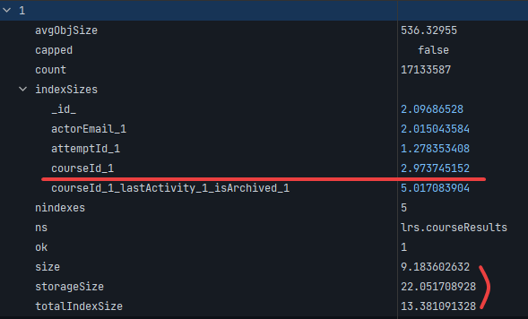

- Якщо запити не мають наміру шукати по всіх документах колекції, наприклад у яких немає певного поля чи які були
  заархівовані створенням boolean поля зі правдивим значенням, то рекомендується використання partial, sparse індексів,
  які не індексують всю колекцію (не працює в doc db), тому зменшують розмір індексу, а також час модифікації
  не індексованих записів.
- Щоб контролювати прогрес побудови індексу, потрібно виконати
  команду `db.currentOp(true).inprog.forEach(function(op){ if(op.msg!==undefined) print(op.msg) })` (Mongodb). Щоб
  зупинити побудову, потрібно виконати команду `dropIndex()`
- Є два способи побудови індексу, foreground версія та background. В той час коли перша отримує lock на всю колекцію,
  друга дозволяє працювати з нею під час побудови, хоч це і повільніше. В останніх версіях монги, ці способи об’єднали,
  тому колекція блокується в початку і в кінці побудови, а під час з колекцією можна працювати як завжди
- Під час побудови індексу використовується диск, тому потрібно слідкувати, щоб вистачало місця. Також для пришвидшення
  операції рекомендується заскейлити екземпляр бази на час побудови індексу.

### Специфіки DocDB

- Побудова не почнеться доки не будуть завершені усі квері, що були запущені до початку побудови
- Якщо відбувається побудова індексу, в Doc DB, не можна розпочинати побудову нового, або видалення іншого в тій же
  колекції, тому що побудова зупиниться з помилкою

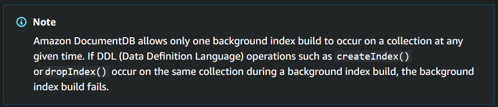

### Ресурси

Майте на увазі, що ми використовуємо версію Amazon Doc DB 3.6, яка по суті сумісна з Mongodb 3.6, але в доках в
основному можна знайти інфу по сумісності 4-ї версії

[Різниця у функціональності](https://docs.aws.amazon.com/documentdb/latest/developerguide/functional-differences.html#functional-differences.array-indexing)
[Різниця в API](https://docs.aws.amazon.com/documentdb/latest/developerguide/mongo-apis.html)
[MongoDB 3.6 doc](https://www.docs4dev.com/docs/en/mongodb/v3.6/reference/core-query-plans.html)
[Official MongoDB Doc - потрібно брати до уваги версію в якій з’явилася зміна про яку читаєте, зазвичай така інформація вказана в тексті](https://www.mongodb.com/docs/v4.2/reference/operator/aggregation/currentOp/)